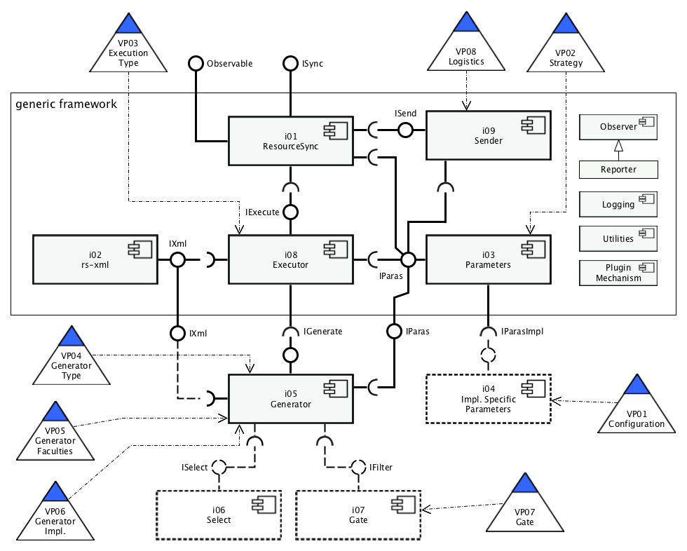
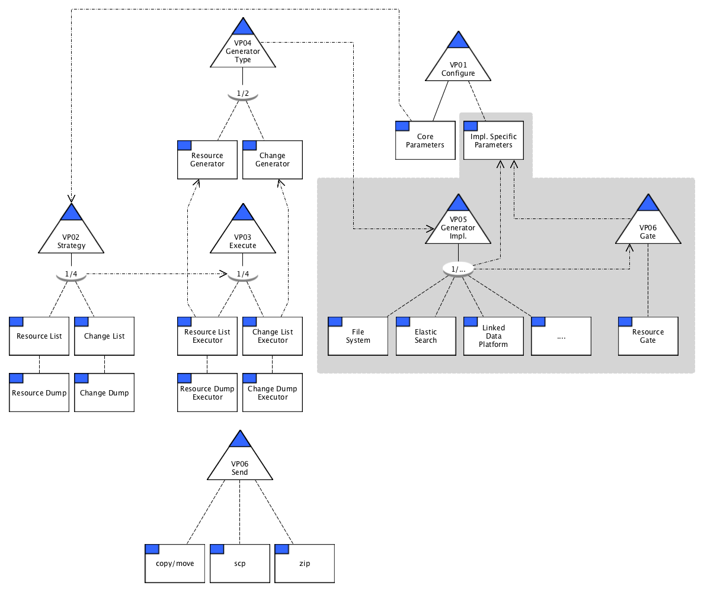

# source-framework
Initial sketches for a ResourceSync Source Framework

---

While sketching a generic implementation of the source side for 
a [ResourceSync](http://www.openarchives.org/rs/1.1/resourcesync)
framework, we lean heavily on [rspub-core](https://github.com/EHRI/rspub-core),
a file-system-specific implementation for the source-side and 
on [omtd-resync-demo](https://github.com/openminted/omtd-resync-demo),
an implementation using 
the [Elasticsearch](https://www.elastic.co/products/elasticsearch) storage system.
It appears that by taking the `Generator` out of the `Executor` in these 
implementations and making these `Generators` pluggable, we can create a generic
framework that can easily be adapted to various types of resource management systems.

In a fully implemented plugin, a `Generator` has specialisations for two
strategies in syncing: a `ResourceGenerator` and a `ChangeGenerator`. 
The `ResourceGenerator` is capable
of listing metadata on initial resources. The `ChangeGenerator` is capable of listing 
metadata on newly created, updated and deleted resources in reference to 
a previous state of the body of resources.

We will first have a walk through the components of such a system, their tasks and
interactions, than have a look at the required variability in the system.

## Component Diagram


_Fig. 1. Component Diagram for a ResourceSync Source Framework. Optional components and
interfaces are in dotted lines._

### Generic Framework
The `generic framework` houses all functionality needed to do a complete ReourceSync
source-side synchronisation - except for picking the resources. 
The `generic framework` offers
the following points of interaction with its environment.

__Required Interfaces__
* `IGenerate` - Connection point for an implementation specific `Generator` plugin.
* `IParasImpl` - Connection point for implementation specific parameters and configuration.

__Provided Interfaces__
* `ISync` - Central entrance point of the framework. Start a ResourceSync run, maybe in time
set repeater function for successive sync runs, time gap between runs.
* `Observable` - Register observers that will receive notifications of events taking place during 
a ResourceSync execution. A default observer could be `Reporter`, keeping a journal
of successive runs, by writing a summary (start time, how many resources where affected, 
end time).
* `IParas` - Read and write parameters and configuration, compute derived parameters.
* `IXml` - Read and write ResourceSync sitemap documents from xml to a class structure
and vice versa.

### i01 ResourceSync
Central component, director of execution, orchestrating execution. 

__Questions:__ Should it be responsible for pasting the rest of the components
together as well or is this a task for an external plugin framework?

__Required interfaces:__
* `IParas` - Parameters, configuration.
* `IExceute` - For executing a resourcesync run.
* `ISend` - Optional. For moving/copying/sending resourcesync metadata files and/or resources
to the document root of a web server.

__Provided interface:__
* `ISync` - Start a ResourceSync run.
* `Observable` - Register observers that will receive notifications of events taking place 
during ResourceSync execution.

### i02 rs-xml
Component capable of converting resourcesync sitemaps from xml to classes and vice versa.

__Provided interface:__
* `IXml` - Convert to and from hierarchical classes and xml streams/files.

### i03 Parameters
Component capable of validating, computing and persisting parameters and configuration 
details for different configurations.

__Required interface:__
* `IParasImpl` - Optional. Provide functionality for persisting implementation specific
parameters and configuration details. Make implementation specific parameters 
accessible.

__Provided interface:__
* `IParas` - Read and write parameters and configuration details from/to file, validate parameters, 
list configurations.

### i04 Implementation Specific Parameters
__Provided interface:__
* `IParasImpl` - Validate and compute implementation specific parameters.


### i05 Generator
Pluggable component capable of yielding metadata items (the data in the element url of an urlset).
A fully implemented `Generator` has both a `ResourceGenerator` and a `ChangeGenerator`.
`ResourceGenerator` is in use for strategies ResourceList and ResourceDump; `ChangeGenerator`
for ChangeList and ChangeDump.

For each applicable resource a `ResourceGenerator` encounters it yields through its provided
`IGenerate` interface at least the values for the elements/attributes:
```xml
		<loc>, <lastmod>, <rs:md hash, length, type/>
```

For each applicable resource a `ChangeGenerator` encounters it yields through its provided
`IGenerate` interface at least the values for the elements/attributes:
```xml
		<loc>, <lastmod>, <rs:md change, datetime, hash, length, type/>
```
Both can also give (values for) the location of the resource on the local file system and/or the 
identifier for the resource. For strategies ResourceDump and ChangeDump being able to
obtain the resource through or by means of the generator is mandatory.
 
__Required interfaces:__
* `ISelect` - Optional. Select resources. (For Generators based on indexing systems this is
probably integrated in the query of a generator it self.)
* `IFilter` - Optional, pluggable. Filter resources. Filtering can be based on metadata on 
the resource or the content of a resource itself. (Filtering based on other criteria?)
* `IXml` Optional. Required if Generator is responsible for comparing present resource state with
previous resource state.

__Provided interface:__
* `IGenerate` - Yield applicable resource metadata items.

### i05 Executor
Component capable of yielding resourcelists or changelists, resourcedumps or changedumps.
The `Executor` delivers a cohesive set of ResourceSync sitemap documents under exactly
one capability list and updates the description.
The `Executor` stages a ResourceSync execution:
* Start processing
* Prepare metadata directory
* Generate ResourceSync documents
* (Pack resources) (Only needed for dump variants.)
* Post process ResourceSync documents
* Create indexes (if applicable)
* Create/update capability list
* Create/update description
* End processing

__Required interfaces:__
* `IGenerate` - Source of applicable resource metadata items.
* `IXml` - For producing sitemaps, xml streams/files
* `IParas` - Source of validated parameters, derived parameters

__Provided interface:__
* `IExcecute` - Execute a specific resourcesync run.

### i06 Sender

Provides logistic services for handling resourcesync metadata and resources after an execution. 
After a successful ResourceSync execution several scenarios are possible:
* Resources and ResourceSync metadata are already under the document root of a web server. 
Synchronization was done 'in situ'. No further action is needed.
* Resources and metadata are on a file sync like [ownCloud](https://owncloud.org/) and
a share is mounted on the web server machine. No further action is needed.
* Local copy. Resources are on the same machine as the web server, but published resources have to be
moved/copied under the document root of the web server.
* Remote copy. Resources and metadata are on a different machine then the web server. Resources
and metadata have to be moved by means of secure copy protocol.
* Zip. Pack resources and metadata in a zip-file that can be handed to a systems admin.

__Required interface:__
* `IParas` - Source of validated parameters, derived parameters.

__Provided interface:__
* `ISend` - Move/copy/send resourcesync metadata files and/or resources to the
document root of a web server or pack them in a zip file.

### i07 Select

Select resources.

### i08 Gate

Filter resources. Pluggable. Scenarios where intricate selecting or filtering of resources is 
needed. Examples: Only schema-valid xml resources must be published. Resources that contain
certain key words must be grouped in sets under different capability lists. Metadata 
on the resource in a database is decisive for publishing the resource. etc.

The generic framework should facilitate a plugin mechanism for `Selectors` and `Gates`.

## Variability Points

The system is expected to have variability on several points. The variability can be in the 
configuration
of external plugins and in the program flow of the process. Both kinds of variability can be
interdependent on each other. 



_Fig. 2. Variability points_

## Variability Model



_Fig. 3. Variability model_


----

---

### VP01 Configure

There required core parameters (metadata_dir, url_prefix, strategy etc.) and implementation specific
parameters. Should we separate them, make them extensible?

### VP02 Strategy

What should the executor produce? Simple an enumeration of the 4 types.

### VP03 Execute

Choice of executor. Coupled on Strategy. 

### VP04 Generate

Choice of type of generator.

### VP05 Generator Impl.

Choice of implementation of generator.

### VP06 Send

Optional pack/send/move metadata and/or resources to document root of server


